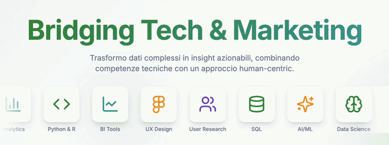

  

## 👨‍💻 About Me

I'm a **Data Scientist** and **Digital Marketer** with a background that bridges **technology and business acumen**.

I studied **Computer Science at the University of Camerino**, building strong technical foundations, and later pursued **Digital Marketing at the University of Modena and Reggio Emilia** to deepen the strategic and business side of data.

During my studies I gained international experience at:

- 🇵🇹 **IPAM Marketing School – Porto** (Business Intelligence, Data Analysis, Project Managament)  
- 🇲🇽 **UDEM University – Monterrey** (AI, Sales Intelligence, Market Research, Methodologies for Innovation)

Today I focus on **transforming complex data into clear insights and strategies**, combining technical skills with a **human-centric approach to data and decision making**.

---

## 🌱 Currently Learning

- API Development  
- Model Deployment on AWS

---

## 🤝 Looking to Collaborate On

- Data Science for **Marketing & Customer Analytics**
- **Predictive models**
- **Business Intelligence dashboards**
- **AI applied to marketing strategy**

---

# 🚀 Tech Stack

## 🧠 Data Science & Machine Learning

---

## 📊 Data & Databases

---

## ☁️ Cloud & Infrastructure

---

## 🌐 Web & Programming

---

# 🌍 Connect With Me

---

# 📈 GitHub Stats

